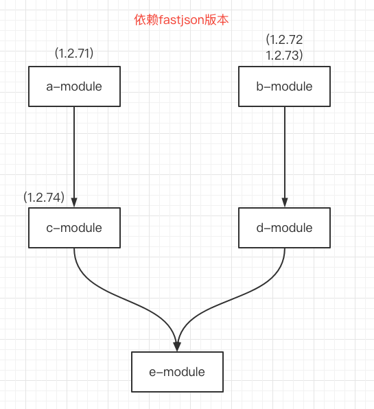

### 版本依赖图

## 1.maven如何决定使用什么版本

比如在一个maven中，依赖了多个依赖。

### 1.1 在同一级

ZHOU-B 和 ZHOU-C是在同一级别。

比如它们两者都依赖了一个fastjson。版本不一致。以后出现的为指定版本。

### 1.2 不在同一级

ZHOU-B 和 ZHOU-E不在同一级别。

如果它们都依赖了一个fastjson。则会以B为准。

## 2.实际例子

**各模块中的版本分别为什么？**

- a-module中的版本是1.2.71
- b-module中的版本是1.2.73。
    - 因为在同一级别，以最后出现的版本为准
- c-module中版本是 1.2.74
    - 因为它本身依赖了1.2.74
    - 依赖了a-module(1.2.71)
    - 级别更浅的生效(1.2.74)
- d-module中版本是1.2.73
- e-module中版本是1.2.74
    - 因为c-module中的级别更浅

## 3.解决办法

- 使用dependencyManagement中，指定版本
- exclude掉不需要的版本